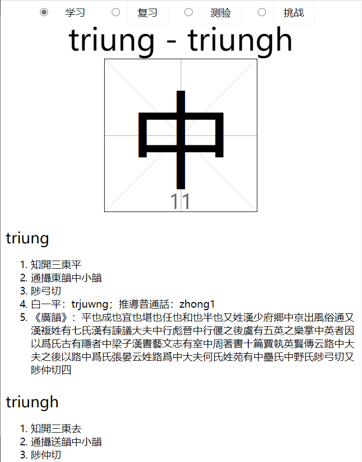

# MemoriseQieyun
背《切韻》（其實是《廣韻》）音韻地位輔助工具


 

## 都是偷的誰的

### 基本框架來自yihui
原項目地址：[yihui/zdict: 汉典网站数据（汉字、拼音、释义等）](https://github.com/yihui/zdict)

相關討論頁面：[cn/kids/2021/02/chars/ · Issue #106 · rbind/yihui](https://github.com/rbind/yihui/issues/106)

原License：[Creative Commons Zero v1.0 Universal](https://github.com/yihui/zdict/blob/main/LICENSE)

大佬可憐我連html都不會，給了一段供本地使用的代碼：

>  离线打包不难，麻烦的只是更新。要离线的话，就得把这些 JS 脚本和 CSS 下载下来；每次我更新之后你得再下载一遍。不求离线的话，这样一个 `.html` 文件就可以了：（代碼略）

本項目css文件夾就是照搬的。index的offline版本依賴之。online版本則保持同步。
js下learn-chars.js也是照搬的。

### 字頻文件來自Chih-Hao Tsai

（再説一遍我是Windows Chauvinist）
我把下面網頁内容製粘貼到了Excel然後保存了csv。

原網站：[Frequency and Stroke Counts of Chinese Characters: Sorted by Frequency](http://technology.chtsai.org/charfreq/sorted.html)

默認讀取了前2500個漢字。然而有的字不在qieyun.sqlite3中，所以總數略少。

### 《廣韻》來自nk2028項目

[nk2028/qieyun-sqlite: A/an SQLite database for the Qieyun phonological system](https://github.com/nk2028/qieyun-sqlite)

License：Public domain.

### 異體字表來自萌典

數據最初由某網友爬蟲，而後經另一位網友轉制。我用了其中的list-2.csv。
[toomore/moedict-variants: 異體字字典](https://github.com/toomore/moedict-variants)

沒License，數據來自萌典，原則上fair use就好吧。

萌典在GitHub：[g0v/moedict-webkit: 萌典網站](https://github.com/g0v/moedict-webkit/)

萌典網頁端：[萌 - 萌典](https://www.moedict.tw/%E8%90%8C)

License在這：[萌典 – 關於本站](https://www.moedict.tw/about.html)


### 其實還用了一下OpenCC

我的電腦不知道怎麽，裝opencc一直報錯，所以一直都是conda_nb，最後測試是Linux（wsl）。
[BYVoid/OpenCC: Conversion between Traditional and Simplified Chinese](https://github.com/BYVoid/OpenCC)

甚至用了一下opencc的variants.txt，不無小補。

然而，我搞完之後才突然想起來有這個：[nk2028/yitizi: Input a Chinese character. Output all the variant characters of it.](https://github.com/nk2028/yitizi)

## 依賴

我的代碼依賴sqlite3和opencc，但是……我就不放上來了。
衆所周知，公開一段讓我的垃圾電腦可以煎蛋的代碼并無益處。

## 其他

下面是示例：

```
piu

幫開三尤平
流攝尤韻不小韻
甫鳩切
白一平：pjuw；推導普通話：fou1
《廣韻》：弗也又姓晉書有汲郡人不準盜發六國時魏王冢得古文竹書今之汲冢記也甫鳩切又甫九甫救二切五
piux

幫開三尤上
流攝有韻缶小韻
方久切
白一平：pjuwX；推導普通話：fou3
《廣韻》：弗也說文作𠀚鳥飛上翔不下來也从一一天也象形又甫鳩甫救二切
pyot

幫合三文入
臻攝物韻弗小韻
分勿切
白一平：pjut；推導普通話：fu
《廣韻》：與弗同又府鳩方久二切
```

拼音用的是一位大佬的中古拼音方案。
大佬人在這：[biopolyhedron](https://github.com/biopolyhedron)

這一拼音方案的維基介紹頁面：[用户:Polyhedron/中古汉语拼音 - 维基百科，自由的百科全书](https://zh.wikipedia.org/zh-cn/User:Polyhedron/%E4%B8%AD%E5%8F%A4%E6%BC%A2%E8%AA%9E%E6%8B%BC%E9%9F%B3)

這一拼音方案對應的輸入法方案：[biopolyhedron/rime-middle-chinese: 中古漢語（切韻音系）全拼及三拼](https://github.com/biopolyhedron/rime-middle-chinese)
（當然，依賴Rime）
Rime：[RIME | 中州韻輸入法引擎](https://rime.im/)


拼音方案終歸是拼音方案，所以加上了白一平的擬音。
白—沙在這：[Baxter-Sagart Old Chinese reconstruction (Version 1.00, 20 Feb. 2011) | CRLAO, EHESS](http://lodel.ehess.fr/crlao/document.php?id=1217)
btw，白、沙二字之間應該用dash而非hyphen，但是我隨便敲的且未加空格。
又：應該是en dash對吧？有懂行的請教我。

您瞧我這readme寫的，就醬。


## 还没搞

- [ ] 一定是代码太烂所以缺了很多字
- [ ] 胡诌一段手动补字的脚本，上传之
- [ ] 更新js，把已经发现的缺字补进去
- [ ] 滚去学css
- [ ] 滚回来把字体调大点，众所周知读书人都眼瞎
